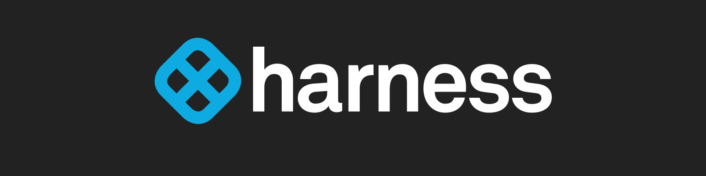

[![Contributors][contributors-shield]][contributors-url]
[![Forks][forks-shield]][forks-url]
[![Stargazers][stars-shield]][stars-url]
[![Issues][issues-shield]][issues-url]
[![MIT License][license-shield]][license-url]
[![LinkedIn][linkedin-shield]][linkedin-url]


<!-- PROJECT LOGO -->
<br />
<p align="center">
  <a href="https://github.com/gabrielcerioni/nw_harbor_watcher">
    
  </a>

  <h3 align="center">Kubernetes Vault Agent - by Gabs the SRE</h3>

<!-- TABLE OF CONTENTS -->
<details open="open">
  <summary>Table of Contents</summary>
  <ol>
    <li>
      <a href="#about-the-project">About The Project</a>
    </li>
    <li>
      <a href="#getting-started">Getting Started</a>
      <ul>
        <li><a href="#prerequisites">Prerequisites</a></li>
        <li><a href="#installation-and-usage">Installation and Usage</a></li>
      </ul>
    </li>
    <li><a href="#roadmap">Roadmap</a></li>
    <li><a href="#contributing">Contributing</a></li>
    <li><a href="#license">License</a></li>
    <li><a href="#contact">Contact</a></li>
    <li><a href="#tech-stack">Tech Stack</a></li>
  </ol>
</details>


<!-- ABOUT THE PROJECT -->
## About The Project

The main goal of this project is to mantain a trustful source of a Harbor Repo Tags Watcher.


<!-- GETTING STARTED -->
## Getting Started

### Prerequisites

* [python3.6+](https://www.python.org/downloads/)

* A Harness account, of course!

* For MacOs Users, please double-check the SSL CERT
   ```sh
   cd /Applications/Python\ 3.9/ # PUT YOUR PYTHON VERSION
   ./Install\ Certificates.command
   ```

### Installation and Usage

1. Clone the repo
   ```sh
   git clone https://github.com/gabrielcerioni/nw_harbor_watcher.git
   ```
2. Install the project dependecies (we only use requests and logging on this one, you may skip)
   ```sh
   pip install -r requirements.txt
   ```
3. Export the required variables (Just to avoid Secrets, KMS, Vaults, etc, to keep this project simple)
   ```sh
   export HARNESS_HARBOR_USER=<USER>
   export HARNESS_HARBOR_PWD=<PWD>
   ```

4. Enjoy ;)
   ```sh
   python3 main.py
   <...>
   ```

<!-- ROADMAP -->
## Roadmap

See the [open issues](https://github.com/gabrielcerioni/harness_graphql_labs/issues) for a list of proposed features (and known issues).


<!-- CONTRIBUTING -->
## Contributing

Contributions are what make the open source community such an amazing place to be learn, inspire, and create. Any contributions you make are **greatly appreciated**.

1. Fork the Project
2. Create your Feature Branch (`git checkout -b feature/AmazingFeature`)
3. Commit your Changes (`git commit -m 'Add some AmazingFeature'`)
4. Push to the Branch (`git push origin feature/AmazingFeature`)
5. Open a Pull Request


<!-- LICENSE -->
## License

Distributed under the MIT License. See `LICENSE` for more information.


<!-- CONTACT -->
## Contact

Gabriel Cerioni - [@gabs.tar.gz](https://www.instagram.com/gabs.tar.gz/) - gacerioni@gmail.com

Project Link: [https://github.com/gabrielcerioni/nw_harbor_watcher/](https://github.com/gabrielcerioni/nw_harbor_watcher/)

<!-- Tech Stack -->
## Tech Stack

* [Python](https://www.python.org/)
* [Harness](https://harness.io)


<!-- MARKDOWN LINKS & IMAGES -->
<!-- https://www.markdownguide.org/basic-syntax/#reference-style-links -->
[contributors-shield]: https://img.shields.io/github/contributors/gabrielcerioni/nw_harbor_watcher.svg?style=for-the-badge
[contributors-url]: https://github.com/gabrielcerioni/nw_harbor_watcher/graphs/contributors
[forks-shield]: https://img.shields.io/github/forks/gabrielcerioni/nw_harbor_watcher.svg?style=for-the-badge
[forks-url]: https://github.com/gabrielcerioni/nw_harbor_watcher/network/members
[stars-shield]: https://img.shields.io/github/stars/gabrielcerioni/nw_harbor_watcher.svg?style=for-the-badge
[stars-url]: https://github.com/gabrielcerioni/nw_harbor_watcher/stargazers
[issues-shield]: https://img.shields.io/github/issues/gabrielcerioni/nw_harbor_watcher.svg?style=for-the-badge
[issues-url]: https://github.com/gabrielcerioni/nw_harbor_watcher/issues
[license-shield]: https://img.shields.io/github/license/gabrielcerioni/nw_harbor_watcher.svg?style=for-the-badge
[license-url]: https://github.com/gabrielcerioni/nw_harbor_watcher/blob/master/LICENSE
[linkedin-shield]: https://img.shields.io/badge/-LinkedIn-black.svg?style=for-the-badge&logo=linkedin&colorB=555
[linkedin-url]: https://linkedin.com/in/gabrielcerioni
[api_postman_all]: images/Postman_API_ALL.png
[api_postman_id]: images/Postman_API_by_id.png
[api_postman_name]: images/Postman_API_by_name.png
